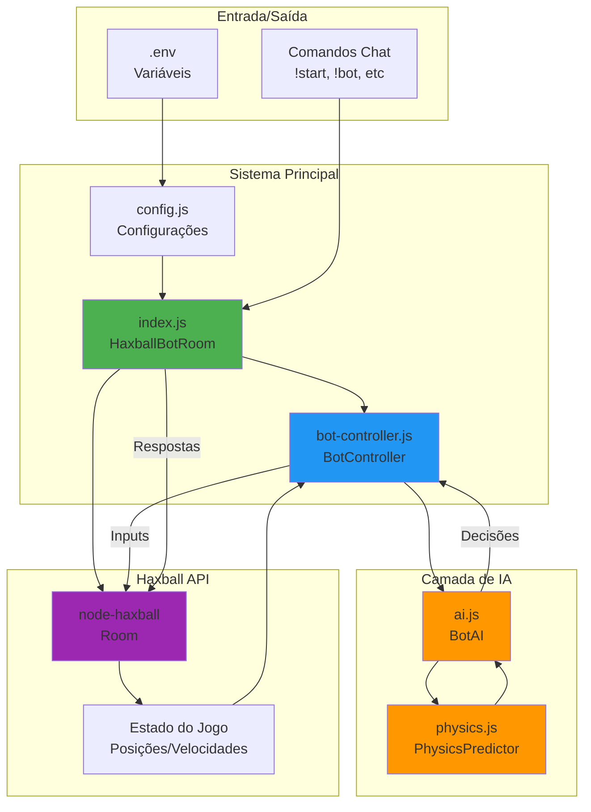
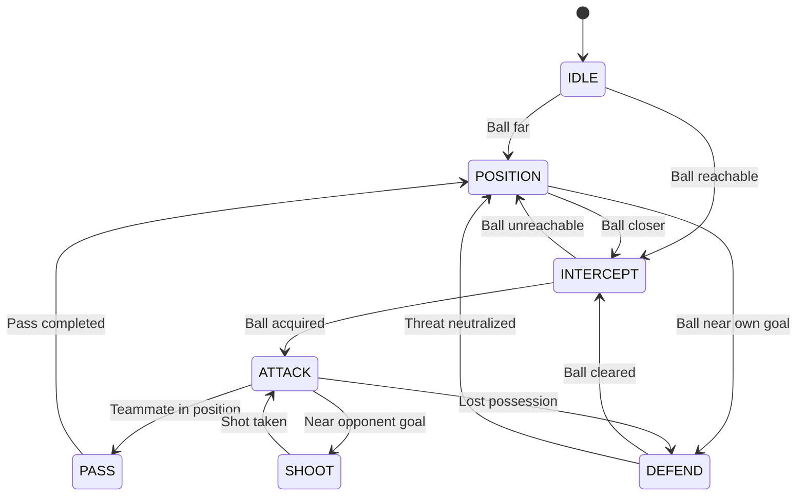

# Arquitetura do Bot de Haxball

## Visão Geral

Este bot foi desenvolvido para jogar Haxball de forma autônoma, utilizando análise de estado do jogo em tempo real e tomada de decisões baseada em IA. O bot é capaz de jogar em salas privadas/treinamento e demonstra comportamentos avançados como controle de bola, posicionamento tático, visão de jogo, passes e defesa.

## Decisão de Integração

### Opções Avaliadas

1. **Headless Host API Oficial** (https://www.haxball.com/headless)
   - ❌ **Limitação crítica**: Não expõe métodos para enviar inputs de jogador (movimento/chute)
   - ✅ Expõe estado do jogo (posições, velocidades, eventos)
   - ⚠️ Permite apenas controle direto de discos via `setDiscProperties` (não é "jogar justo")

2. **node-haxball (biblioteca comunitária)**
   - ✅ **Escolha adotada**: Suporta criação de sala headless E controle de inputs de jogador
   - ✅ Licença MIT
   - ✅ Método `room.setKeyState(state)` para enviar inputs como jogador real
   - ✅ Acesso completo ao estado do jogo via `room.state` e `room.gameState`
   - ✅ Mantido ativamente pela comunidade

3. **Userscript/Extension no navegador**
   - ❌ Complexidade adicional de setup
   - ❌ Dependência do navegador do usuário
   - ❌ Menos robusto para automação

### Solução Escolhida: node-haxball + Sala Headless Privada

O bot funciona como um **host de sala headless** que também joga como um jogador real dentro dessa sala. Isso permite:

- ✅ Controle total da sala (configurações, comandos, etc.)
- ✅ O bot envia inputs reais (teclas de movimento + chute) como um jogador humano
- ✅ Outros jogadores podem entrar na sala para jogar contra/com o bot
- ✅ Física e regras oficiais do Haxball são mantidas
- ✅ Uso exclusivo em salas privadas/treinamento (conforme requisitos)

## Diagrama de Arquitetura



## Componentes Principais

### 1. **index.js - HaxballBotRoom**
- **Responsabilidade**: Gerenciamento da sala e ciclo de vida
- **Funcionalidades**:
  - Criação da sala headless com autenticação
  - Registro de event handlers (onPlayerJoin, onGameTick, etc.)
  - Processamento de comandos de chat
  - Gerenciamento de times e início de partidas

### 2. **bot-controller.js - BotController**
- **Responsabilidade**: Ponte entre o bot e o jogo
- **Funcionalidades**:
  - Inicialização dos módulos de física e IA
  - Loop principal de atualização a cada tick (60 Hz)
  - Conversão de decisões da IA em inputs de teclado
  - Codificação de estados de tecla (0-31)
  - Gerenciamento de estado ativo/inativo do bot

### 3. **ai.js - BotAI**
- **Responsabilidade**: Tomada de decisões inteligentes
- **Funcionalidades**:
  - Análise do estado do jogo (bola, jogadores, times, gols)
  - Máquina de estados: IDLE, ATTACK, DEFEND, INTERCEPT, SHOOT, PASS, POSITION
  - Decisões baseadas em utilidade (distância, posicionamento, ameaça)
  - Tempo de reação configurável
  - Lógica de chute, drible, passe e defesa

### 4. **physics.js - PhysicsPredictor**
- **Responsabilidade**: Simulação e predição física
- **Funcionalidades**:
  - Predição de trajetória da bola (N ticks no futuro)
  - Simulação de física: damping, colisões com paredes, bounces
  - Cálculo de ponto de interceptação mais próximo
  - Avaliação de chances de gol (ângulo, distância, goleiro)
  - Cálculo de posição defensiva ideal
  - Identificação do melhor alvo para passe

### 5. **config.js - Config**
- **Responsabilidade**: Gerenciamento de configurações
- **Funcionalidades**:
  - Presets de dificuldade (easy, medium, hard, insane)
  - Configurações da sala (nome, senha, jogadores max)
  - Parâmetros de IA (tempo de reação, ticks de predição, agressividade)
  - Validação de configuração (token obrigatório)

## Fluxo de Execução

### Inicialização
1. Carrega variáveis de ambiente (.env)
2. Cria instância de Config
3. Gera autenticação com `Utils.generateAuth()`
4. Cria sala headless com `Room.create()`
5. Registra event handlers
6. Aguarda link da sala e jogadores

### Loop de Jogo (60 ticks/segundo)
1. **onGameTick** é disparado
2. **BotController.update()** é chamado
3. Room state é extrapolado (`room.extrapolate()`)
4. **BotAI.decide()** analisa o estado:
   - Coleta posição da bola, jogadores, times
   - Determina estado do jogo (atacar, defender, interceptar, etc.)
   - Calcula predições de física quando necessário
5. IA retorna decisão: `{dirX, dirY, kick}`
6. BotController codifica em keyState (0-31)
7. Envia input com `room.setKeyState(keyState)`

### Estratégias de IA

#### Estados do Jogo



#### Decisões Baseadas em Contexto

| Estado | Condição | Ação |
|--------|----------|------|
| **KICKOFF** | Início de jogo | Correr direto para a bola |
| **INTERCEPT** | Bola alcançável em < 30 ticks | Calcular ponto de interceptação, mover até lá |
| **ATTACK** | Próximo à bola, longe do gol oponente | Driblar em direção ao gol |
| **SHOOT** | Distância ao gol < 150, tem chance de gol | Mirar no centro do gol, chutar |
| **PASS** | Tem companheiros, chance de passe | Encontrar melhor alvo, passar |
| **DEFEND** | Bola próxima do próprio gol | Posicionar entre bola e gol, interceptar |
| **POSITION** | Nenhuma condição especial | Mover em direção à bola |

## Predição de Física

### Simulação de Tick
Para cada tick simulado:
1. Aplica velocidade: `x += xspeed`, `y += yspeed`
2. Aplica damping: `xspeed *= damping`, `yspeed *= damping`
3. Detecta colisões com paredes
4. Aplica bounce com perda de energia (0.8x)

### Cálculo de Interceptação
1. Simula trajetória da bola N ticks
2. Para cada posição futura:
   - Calcula distância do jogador
   - Estima ticks necessários baseado em velocidade máxima
   - Retorna primeiro ponto onde `ticks_necessários <= tick_futuro`

### Avaliação de Chute
1. Probabilidade base = `1 - (distância / 400)`
2. Penalização se goleiro está próximo: `prob *= max(0.2, dist_goleiro / 50)`
3. Considera `canScore = true` se `prob > 0.3`

## Configuração de Dificuldade

| Parâmetro | Easy | Medium | Hard | Insane |
|-----------|------|--------|------|--------|
| Tempo de Reação (ms) | 150 | 50 | 20 | 10 |
| Ticks de Predição | 15 | 30 | 45 | 60 |
| Força de Chute | 0.7 | 1.0 | 1.0 | 1.0 |
| Peso de Posicionamento | 0.5 | 0.7 | 0.85 | 0.95 |
| Agressividade | 0.3 | 0.5 | 0.7 | 0.9 |
| Velocidade Máxima | 0.7 | 1.0 | 1.0 | 1.0 |

## Roadmap de Evolução

### Fase 1 (Atual): Sistema Baseado em Regras
- ✅ Máquina de estados
- ✅ Predição de física
- ✅ Decisões baseadas em utilidade
- ✅ Configurações ajustáveis

### Fase 2 (Futuro): Aprendizado por Simulação
- 🔲 Geração de partidas bot vs bot em massa
- 🔲 Coleta de métricas (gols, posse, interceptações)
- 🔲 Otimização de parâmetros via algoritmos genéticos
- 🔲 Sistema de replay para análise

### Fase 3 (Futuro): Reinforcement Learning
- 🔲 Integração com biblioteca de RL (stable-baselines3, RLlib)
- 🔲 Definição de reward function (gols, posse, posicionamento)
- 🔲 Treinamento com PPO/A3C
- 🔲 Modelos de rede neural para predição de valor/política

## Testes

### Testes Unitários
- **physics.test.js**: Validação de predição de trajetória, interceptação, avaliação de chutes
- **ai.test.js**: Validação de decisões, estados do jogo, movimentação

### Testes E2E
- **bot-integration.test.js**: Validação de inicialização, integração com sala, codificação de inputs

### Execução
```bash
npm test              # Todos os testes
npm run test:unit     # Apenas unitários
npm run test:e2e      # Apenas E2E
```

## Segurança e Ética

⚠️ **IMPORTANTE**: Este bot é desenvolvido **exclusivamente** para uso em:
- Salas privadas/com senha
- Treinamento pessoal
- Testes contra amigos

**NÃO use este bot em:**
- ❌ Salas públicas ranqueadas
- ❌ Competições oficiais
- ❌ Salas de terceiros sem permissão

O uso em salas públicas pode resultar em **banimento** da conta e viola os termos de uso do Haxball.

## Limitações Conhecidas

1. **Física Simplificada**: Não modela 100% da física do Haxball (kick strength exato, curvas, etc.)
2. **Sem Memória**: Decisões baseadas apenas no estado atual, sem histórico
3. **Passes Básicos**: Lógica de passe não considera movimento dos jogadores
4. **Goleiro**: Não tem modo especializado de goleiro (sempre joga como campo)
5. **Bank Shots**: Não calcula chutes com ricochete nas paredes

## Referências

- [Haxball Headless Host API](https://github.com/haxball/haxball-issues/wiki/Headless-Host)
- [node-haxball (biblioteca)](https://github.com/wxyz-abcd/node-haxball)
- [Haxball Physics Discussion](https://www.haxball.com/physics)
